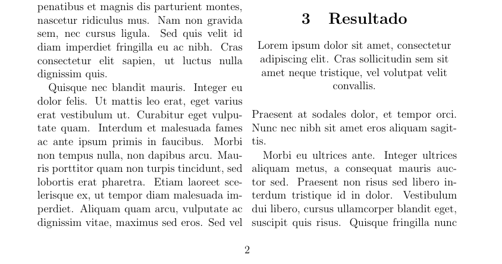

# Alinhamento do texto

Da mesma forma que podemos alterar a nossa fonte, podemos mudar o alinhamento do texto.
O LaTeX vem com trềs alinhamentos padrões: à esquerda, à direita e centralizado.

### Alinhando usando ambientes

Para alterar o alinhamento de um trecho do texto, colocamos o texto dentro de um dos seguintes ambientes.

| alinhamento | ambiente |
| ----------- | -------- |
| à esquerda | `flushleft` |
| à direita | `flushright` |
| centralizado | `center` |

### Alinhando todo o texto

Da mesma forma que para alterar o tamanho da fonte, para mudar o alinhamento de todo o texto,
podemos usar os seguintes comandos antes do mesmo:

| alinhamento | comandos |
| ----------- | -------- |
| à esquerda | `\raggedleft` |
| à direita | `\raggedright` |
| centralizado | `centering` |

Lembrando que se esses comandos forem usados dentro de um bloco (um texto entre chaves), ele só vai ser aplicado dentro desse.

## O pacote ragged2e

O pacote `ragged2e` adiciona o alinhamento justificado no seu documento, algo que não pode ser feito naturalmente no LaTeX.
Após importar o pacote (não precisa de nenhum parâmetro), você pode justificar o texto das seguintes formas:

| ambiente | comando |
| -------- | ------- |
| `justify` | `\justify` | 

## Exemplo

No trecho do documento abaixo, o primeiro parágrafo da seção resultado está centralizado, incluindo o título.

``` tex
\begin{center}
  \section{Resultado}
  Lorem ipsum dolor sit amet, consectetur adipiscing elit.
  Cras sollicitudin sem sit amet neque tristique, vel volutpat velit convallis.    
\end{center}
```
