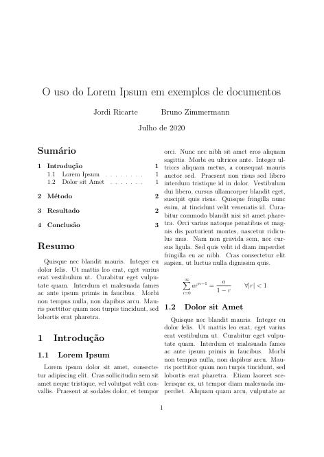

# Capítulos e seções

Os documentos no LaTeX podem ser divididos em:

| nivel | subdivisão |
| ----- | ---------- |
| -1 | part |
| 0 | chapter |
| 1 | section |
| 2 | subsection |
| 3 | subsubsection |
| 4 | paragraph |
| 5 | subparagraph |

Nem todos os documentos tem todas as subdivisões.
*Por exemplo*, a classe article não aceita as subdivisões part e chapter.

## Comando

Para criar uma nova divisão (no exemplo, uma seção) você deve usar o seguinte comando:

``` tex
\section[nome curto]{nome da seção}
```

Lembrando que o nome curto é opcional, e é como a seção será referenciada no sumário caso o nome dessa seja muito longo.

Caso você queira criar qualquer outra divisão, basta usar o comando específico - que será análogo ao comando `\section`

### Divisões não numeradas.

Caso você queira criar uma divisão não numerada, basta colocar um * antes dos parâmetros.
Por exemplo:

``` tex
\section*{nome da seção}
```

Vale lembrar que essa seção não será inserida no sumário do texto.

## Exemplo

No nosso documento, temos seções numeradas e não numeradas.
A divisão da primeira página que escrevemos (tirando título e sumário, que já foram abordados anteriormente) foi gerada com a seguinte sequência de comandos.

``` tex
\section*{Resumo}
    % Texto do resumo

\section{Introdução}

\subsection{Lorem Ipsum}
    % Texto da subseção 1

\subsection{Dolor Sit Amet}
    % Texto da subseção 2
```

