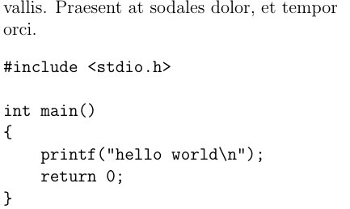

# Escrevendo código

Em alguns momentos, será necessário escrever códigos no seu documento,
para facilitar a escrita desses, o LaTeX possui um ambiente próprio para isso.
Dentro do ambiente `verbatim`, o texto utiliza o estilo de fonte typewritter e é compilado exatamente da forma que foi escrito, inclusive espaços múltiplos e caracteres reservados do LaTeX.

``` tex
%texto anterior

\begin{verbatim}
#include <stdio.h>

int main()
{
    printf("hello world\n");
    return 0;
}
\end{verbatim}

```



**Importante**: no ambiente verbatim a quebra de linha não é automática, então se você colocar uma linha muito grande, ela irá cortar o texto.