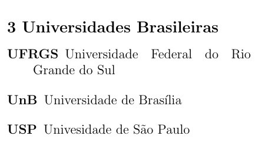

# Descrições

Uma lista de descrições é criada usando o ambiente `description`, e cada item é indicado usando o comando `\item[termo]` dentro do ambiente.

``` tex
\begin{description}
    \item[UFRGS] Universidade Federal do Rio Grande do Sul
    \item[UnB] Universidade de Brasília
    \item[USP] Univesidade de São Paulo
\end{description}
```

Nesse exemplo, vamos ter a seguinte lista (o título foi omitido do código).

