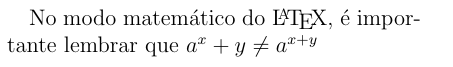
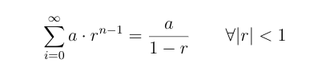
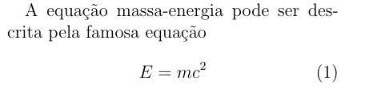

# Como entrar no ambiente matemático

Você pode entrar no modo matemático tanto dentro de um parágrafo quanto em uma linha a parte.

## Dentro de um parágrafo (inline)

Se você quer escrever uma equação no meio de um texto, você pode colocar a equação entre símbolo de `$`.
Por exemplo:

``` tex
No modo matemático do \LaTeX{}, é importante lembrar que
$ a^x+y \ne a^{x+y} $
```



## Criando equação não numerada

Se você quiser criar uma equação separada do texto, mas não numerada, você pode colocar a equação entre os símbolos `$$`.
Por exemplo:

``` tex
 $$
     \sum_{i=0}^{\infty} a \cdot r^{n-1} = \frac{a}{1-r}
     \qquad \forall |r| < 1
 $$
```



Uma alternativa que gera o mesmo resultado é utilizando o ambiente `equation*`, que vem do pacote `amsmath`.

## Criando equações numeradas

Agora, se você precisar criar uma equação numerada, você pode utilizar o ambiente `equation`, como no exemplo abaixo:

``` tex
A equação massa-energia pode ser descrita pela famosa equação
\begin{equation}
    E=mc^2
\end{equation}
```

