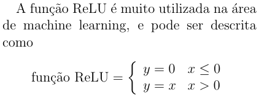

# Escrevendo texto no ambiente matemático

Se você quiser escrever um texto dentro do ambiente matemático, podemos usar o comando
`\text{texto}`, do pacote `amsmath`.

``` tex
% Texto omitido

$$
text{função ReLU} = 
\left\{
    \begin{array}{ll}
        y = 0 & x \leq 0 \\
        y = x & x > 0
    \end{array}
\right.
$$
```

