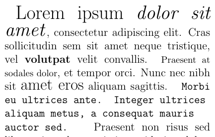

# Formatos de fonte

O LaTeX trás para nós formas simples de mudar o estilo e o tamanho da fonte.
Recomendo que você teste os diversos estilos e tamanhos no seu documento.

## Alterando o estilo

Podemos alterar o estilo tanto de um pequeno excerto, passando esse como parâmetro de um comando,
quanto de todo um bloco (área delimitada por chaves).
Na tabela abaixo temos os comandos para mudar um trecho e um bloco de texto.

| estilo | Comando para trecho | Comando para bloco |
| ------ | ------------------- | ------------------ |
| monespaçado | `\texttt{texto}` | `{ \ttfamily texto }` |
| sans-serif | `\textsf{texto}` | `{ \sffamily texto }` |
| serif | `\textrm{texto}` | `{ \rmfamily texto }` |
| | |
| negrito | `\textbf{texto}` | `{ \bfseries texto }` |
| itálico | `\textit{texto}` | `{ \itshape texto }` |
| inclinado | `\textsl{texto}` | `{ \slshape texto }` |
| maiúsculas | `\textsc{texto}` | `{ \scshape texto }` |
| | |
| sublinhado | `\underline{texto}` | *não tem* |
| enfatizado | `\emph{texto}` | *não tem* |

Importante lembrar que, se os comandos de bloco não estiverem entre chaves, o estilo vai ser utilizado para tudo que vier abaixo dele, até o fim do documento.
o contrário dos estilos, os comandos para alterar um trecho ou um bloco são o mesmo.
## Alterando o Tamanho

Da mesma forma que podemos alterar o estilo da fonte, podemos alterar o tamanho dela.
Exitem 10 tamanhos de fonte e, diferente dos estilos, os tamanhos só se aplicam em blocos.

A ordem dos tamanhos é:

1.  `\tiny`
2.  `\scriptsize`
3.  `\footnotesize`
4.  `\small`
5.  `\normalsize`
6.  `\large`
7.  `\Large`
8.  `\LARGE`
9.  `\huge`
10. `\Huge`

## Exemplo

No parágrafo abaixo fizemos diversas alterações de tamanho e estilo no texto.

``` tex
 {\LARGE Lorem ipsum \textit{dolor sit amet}}, consectetur adipiscing elit.
 Cras sollicitudin sem sit amet neque tristique, vel \textbf{volutpat} velit convallis.
 {\footnotesize Praesent at sodales dolor}, et tempor orci.
 Nunc nec nibh sit {\Large amet eros} aliquam sagittis. 
 { \ttfamily
 Morbi eu ultrices ante. Integer ultrices aliquam metus, a consequat mauris auctor sed.
 }
 ```
