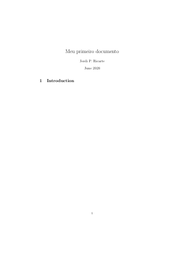

# Hello World

Ao criar um documento novo no Overleaf, você terá algo como isso:

``` tex
\documentclass{article}
\usepackage[utf8]{inputenc}

\title{Nome do documento}
\author{Seu nome}
\date{Data}

\begin{document}

    \maketitle

    \section{Introduction}

\end{document}
```

Com esses comandos vamos ter o seguinte documento:



Isso pode parecer confuso. Fique tranquilo.

Primeira coisa que vamos fazer é comentar o que significa cada coisa, assim podemos abordar cada elemento individualmente.
Para fazer um comentário, basta usar um **%**.

``` TeX
%Preâmbulo do documento%
\documentclass{article} %Configura o documento (no caso, um artigo)
\usepackage[utf8]{inputenc} %Importa o pacote inputenc, usando a opção utf8

\title{Meu primeiro documento} %define o título
\author{Seu nome} %define o nome do(s) autor(es)
\date{June 2020} %define a data

%Corpo do documento%
\begin{document} %inicia o ambiente 'document'

    \maketitle %Insere título, autor e data no documento

    \section{Introduction} %Começa a seção que vai ter o nome de 'Introduction'

\end{document} %Fim do ambiente 'document'
```

A seguir vamos abordar cada parte desse documento.