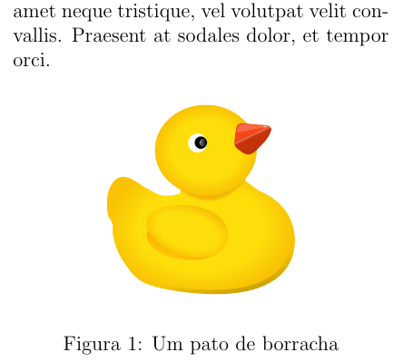

# Inserindo Imagens

O LaTeX tem uma biblioteca específica para utilizar imagens no documento.
O pacote `graphicx` habilita um ambiente chamado `figure`, que permite que você insira imagens de uma forma simples no texto.

Assim como o pacote para tabelas, este também é bem complexo. Aqui iremos fazer apenas uma pequena introdução sobre o tema, mas caso você queira se aprofundar, você pode acessar 
[esse artigo](https://www.overleaf.com/learn/latex/Inserting_Images "Artigo do Overleaf sobre imagens") 
(em inglês).

## Código

``` tex
\begin{figure}[hb] % Parâmetros de posição
    \centering % Centralizando imagem na posição
    \includegraphics[scale=0.08]{./pato.png} % Inserindo imagem redimensionada
    \caption{Um pato de borracha} % Legenda da imagem
\end{figure}
```



**Importante**: o comando `\centering` já foi abordado
[Nessa seção sobre alinhamento](./alinhamento.md).

### Parâmetro de posição

Ao iniciar o ambiente figure, podemos passar em que posição queremos que o compilador insira a imagem e, colocando diversas opções, o LaTeX vai achar na posição mais adequada, seguindo a ordem recebida.

| código | significado |
| ------ | ----------- |
| h | Próximo de onde foi colocado no texto |
| t | No topo da página |
| b | No fim da página |
| p | Em uma página própria |
| ! | Ignora parâmetros que impediriam colocar a imagem em uma posição |

No caso do exemplo, estamos dizendo ao compilador:

``` tex
\begin{figure}[hb]
```

1. Colocar a imagem próxima da sua posição no texto.
2. Se não for possível, colocar no fim da página.

### Inserindo imagem

Para inserir o arquivo `imagem.png`, usamos o comando:

``` tex
\includegraphics[tamanho]{caminho/para/imagem.png}
```

#### Tamanho

A imagem será inserida em seu tamanho original.
Para redimensioná-la, você pode passar como parâmetro opcional o novo tamanho dela.

No exemplo, eu usei o argumento `scale=0.08`, dizendo que quero que as dimensões sejam o equivalente a 8% das originais. 
Porém, existem outras formas de redimensionar a imagem, como por exemplo:

``` tex
    % Insere uma imagem com 3cm de largura e 4cm de altura
    \includegraphics[width=3cm, height=4cm]{caminho/para/imagem.png}

    % Insere uma imagem com a mesma largura do texto
    \includegraphics[width=\textwidth]{caminho/para/imagem.png}
```

### Legenda

Para inserir uma legenda na imagem, basta acrescentar o comando `\caption{sua legenda}` após inserir a imagem, ainda no ambiente `figure`.