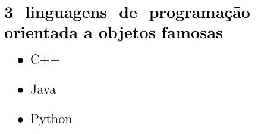

# Lista não ordenada

Uma lista não ordenada é criada usando o ambiente `itemize`, e cada item é indicado usando o comando `\item` dentro do ambiente.

``` tex
\begin{itemize}
    \item C++
    \item Java
    \item Python
\end{itemize}
```

Nesse exemplo, vamos ter a seguinte lista (o título foi omitido do código):

