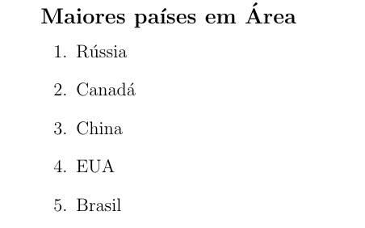

# Lista ordenada

Uma lista ordenada é criada usando o ambiente `enumerate`, e cada item é indicado usando o comando `\item` dentro do ambiente.

``` tex
\begin{enumerate}
    \item Rússia
    \item Canadá
    \item China
    \item EUA
    \item Brasil
\end{enumerate}
```

Nesse exemplo, vamos ter a seguinte lista (o título foi omitido do código).

