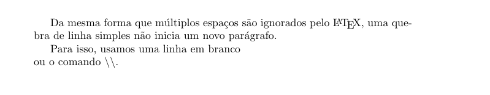

# Sintaxe

## Comandos
Os comandos podem ter parâmetros obrigatórios - que ficam entre chaves - e opcionais, que ficam entre colchetes (antes dos obrigatórios). Por exemplo:

```tex
\comando[parametros opcionais]{parametros obrigatórios}
```

### Exemplo
```tex
%Comando para escolher classe de documento
\documentclass[titlepage]{letter}
```

Outra coisa importante de se dizer, é que comentários em LaTeX são feitos usando o símbolo **%**.

## Ambientes
Ambientes são regiões separadas pelos comandos `\begin{ambiente}` e `\end{ambiente}`, que indicam ao compilador que tudo que tiver nesse bloco será compilado de uma forma pré-definida.

O exemplo mais comum de ambiente é o `document`, que é o ambiente que indica o que deve ser tratado como corpo do texto.

## Texto

Como dito na introdução, o LaTeX não compila o texto exatamente da forma como está no arquivo .tex.
Isso faz com que coisas como multiplos espaços sejam ignorados.
Da mesma forma, uma quebra de linha simples no código não irá iniciar um novo parágrafo no texto. Para isso, você deve deixar uma linha em branco entre os dois parágrafos.

```
Da mesma forma     que múltiplos espaços
são ignorados pelo \LaTeX{}, uma quebra
de linha simples não inicia um novo parágrafo.

Para isso, usamos uma linha em branco \\ 
ou o comando \textbackslash \textbackslash .

```
*Obs*: Usamos o {} após o comando \LaTeX pois, se não usassemos, ele irá ficar colado com a 
próxima palavra, ignorando o espaço entre essas.



## Caracteres reservados

Você deve ter visto, o LaTeX tem diversos caracteres reservados. A função deles será visto ao longo
desse material, mas aqui você pode ver como escrever esses no seu documento.

| Caracter | Como escrever [^1] |
| -------- | ------------- |
| $ | `\$` |
| # | `\#` |
| % | `\%` |
| ^ | `\^` |
| & | `\&` |
| _ | `\_` |
| { | `\{` |
| } | `\}` |
| ~ | `\~` |
| \ | `\textbackslash` |

[^1]: Em sumo, basta colocar um \ em na frente de cada caracter, com exceção do próprio, poís a sequencia `\\` indica quebra de linha.