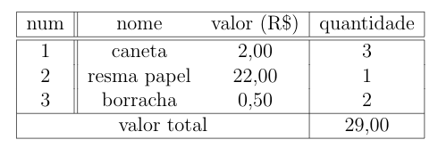

# Tabelas

No LaTeX, tabelas são feitas usando o ambiente `tabular`.
Porém, diferentemente das listas, esse ambiente em uma forma mais rígida de ser utilizado.

Nessa página, iremos ver como montar uma tabela simples, por ser um material para iniciantes.
Se você quiser gerar uma tabela mais complexa, você pode ler
[esse artigo](https://www.overleaf.com/learn/latex/tables "Artigo do Overleaf sobre tabelas")
(em inglês).

## Iniciando o Ambiente

Ao iniciar o ambiente, você deve passar como as colunas vão ser divididas como parâmetro obrigatório.

``` tex
\begin{tabular}{ | c || c c | c | }
```

O que esse parâmetro diz é que, nesse exemplo, as 4 colunas, indicadas por `c`, estão separadas de forma que:

- Tenha uma linha vertical no inicio à esquerda da tabela;
- Tenha uma linha vertical dupla entre as duas primeiras colunas;
- As duas colunas centrais fiquem separadas por espaços;
- tenha uma linha vertical entre a 3ª e a 4ª coluna;
- uma linha vertical no fim da tabela;

## Escrevendo a tabela

Dentro do ambiente tabular, nós vamos escrever uma tabela, como a abaixo

``` tex
\begin{tabular}{ | c || c c | c | }
    \hline
    num & nome & valor (R\$) & quantidade \\
    \hline \hline
    1 & caneta & 2,00 & 3 \\
    2 & resma papel & 22,00, & 1 \\
    3 & borracha & 0,50 & 2 \\
    \hline
    \multicolumn{3}{|c|}{valor total} & 29,00 \\ 
    \hline
\end{tabular}
```



Por mais que possa parecer complicado, cada parte dessa tabela será explicada a seguir.

### \hline

O Comando `\hline` insere uma linha horizontal em nossa tabela.
Uma linha dupla pode ser feita usando esse comando duas vezes seguidas.

### Colocando informações
Para cada linha da sua tabela, você irá separar as células utilizando um  `&`,
finalizando a linha com um comando de quebra de linha `\\`.
O cabeçalho é um exemplo de como escrever uma linha de tabela.

``` tex
num & nome & valor (R\$) & quantidade \\
```

**Importante**: É essencial que o numero de células em cada linha seja o mesmo que foi informado no inicio do ambiente.

### \multicolumn

O `\multicolumn` é um comando que permite você gerar células que ocupam múltiplas colunas.
Você irá passar 3 parâmetros obrigatórios (entre chaves), na seguinte ordem:

1. O número de colunas que essa célula irá ocupar.
2. Como será a separação das colunas antes e depois dessa célula
3. O valor que estará dentro dessa.
