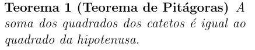

# Teoremas

Embora os teoremas não façam parte do ambiente matemático *per se*, ele muitas vezes é utilizado em conjunto, por isso, iremos abordar ele aqui.

## Criando um ambiente de teoremas

No preâmbulo, iremos usar o comando

``` tex
\newtheorem{nome_ambiente}{Título}
```

- **nome_ambiente**:
    O nome do ambiente que você vai criar. É assim que você vai chamar ele quando iniciar um novo ambiente
- **Título**:
    É o que será impresso no início do ambiente.

Por exemplo, para criar um ambiente com o título Teorema, o nosso comando ficaria algo como:

``` tex
\newtheorem{teo}{Teorema}
```

## Escrevendo um teorema

Com o ambiente configurado, podemos inserir um teorema no texto chamando o ambiente criado.
Por exemplo, usando o exemplo acima:

``` tex
\begin{teo}[Teorema de Pitágoras]
    A soma dos quadrados dos catetos é igual ao quadrado da hipotenusa.
\end{teo}
```



Note que podemos passar, como parâmetro opcional do ambiente, o nome do nosso teorema.