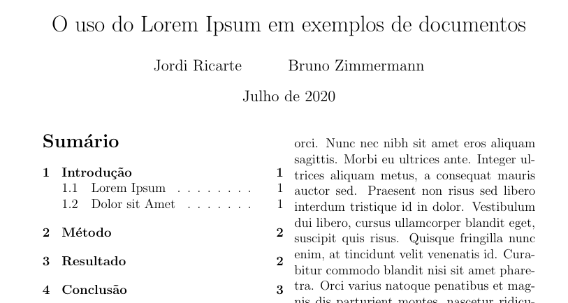

# Título e Sumário

## Título

A primeira informação que seu documento terá é um título.
Como as informações desse já foram feitas no preâmbulo do texto, podemos simplesmente usar o comando:

``` LaTeX
\maketitle
```

Esse comando irá imprimir o título de acordo com as configurações da classe de documento usada.

## Sumário

De forma similar ao título, existe um comando que faz de forma automatica o sumário do documento, de acordo com os capítulos, seções e outros, que serão abordados no tópico seguinte.
O comando para gerar um sumário é:

``` LaTeX
\tableofcontents
```

## Exemplo

Para o documento que estamos criando nessa seção, poderiamos ter o seguinte título e sumário.

